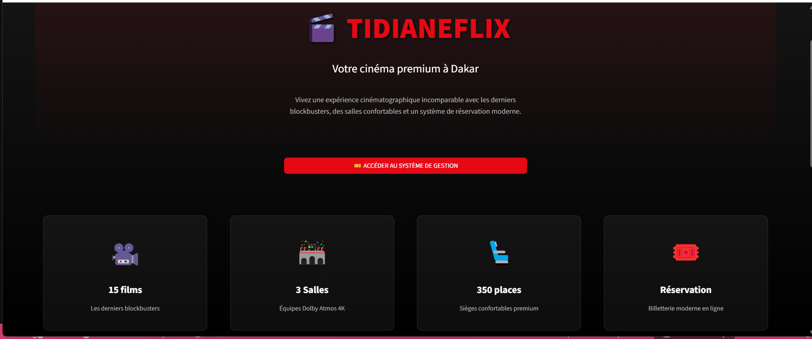
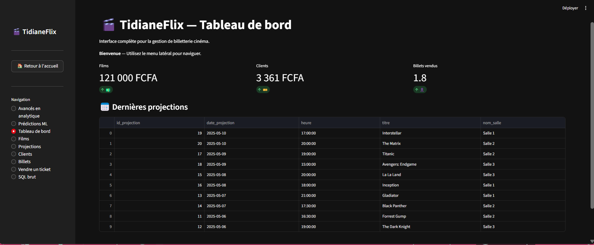
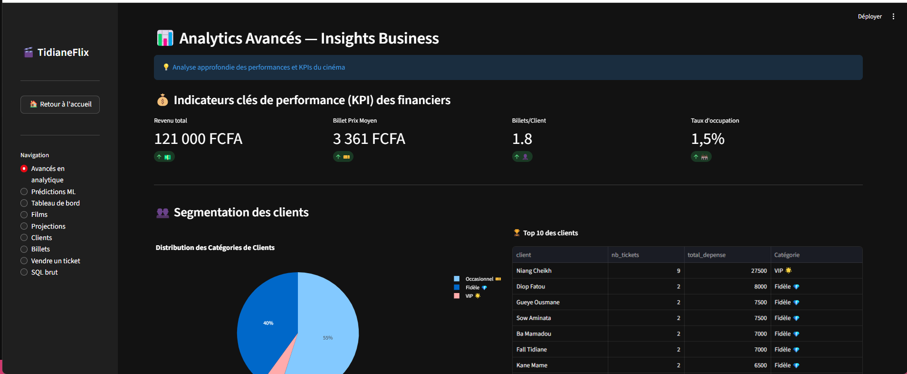
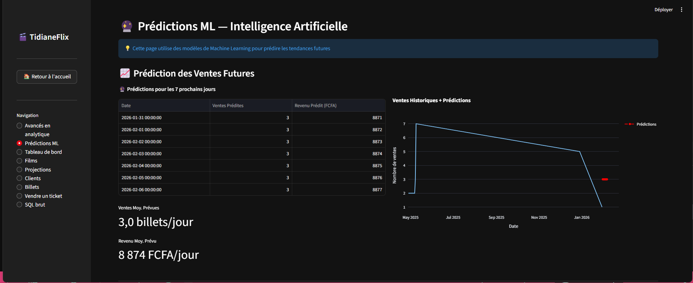

# 🎬 TidianeFlix
### Système Complet de Gestion de Cinéma avec Base de Données Relationnelle

[](https://www.python.org/)
[](https://www.sqlite.org/)
[](https://streamlit.io/)
[](LICENSE)

---

## 📋 CONTEXTE & PROBLÉMATIQUE

La gestion manuelle des cinémas (réservations papier, suivi Excel, absence de statistiques temps réel) génère inefficacités et perte de revenus. Les petits et moyens cinémas en Afrique manquent de solutions abordables et adaptées à leur contexte.

**Objectif du projet :** Développer un système complet de gestion de cinéma avec base de données relationnelle robuste et interface web moderne, permettant la gestion des films, séances, réservations, clients et analyses de performance.

---

## 🎯 SOLUTION DÉVELOPPÉE

Application web professionnelle pour la gestion complète d'un cinéma :

### Fonctionnalités Principales
- **Gestion du catalogue** : 15 films avec métadonnées complètes (genre, durée, réalisateur)
- **Planification des séances** : 20 projections sur 3 salles (capacité totale 350 places)
- **Système de réservation** : Interface intuitive pour vente de tickets
- **Gestion clients** : Base de 20 clients avec historique d'achats
- **Analytics avancés** : Statistiques de fréquentation, revenus, films populaires
- **Système d'avis** : Notation et commentaires clients (1-5 étoiles)

**Technologies :** SQLite + Python Streamlit + Interface responsive style Netflix

---

## 🗄️ ARCHITECTURE BASE DE DONNÉES

### Modèle Relationnel (6 Tables)
```sql
CLIENT (id_client, nom, prenom, email, telephone)
↓
TICKET (id_ticket, prix, date_achat, id_client, id_projection)
↓
PROJECTION (id_projection, date_projection, heure, id_film, id_salle)
↓
FILM (id_film, titre, genre, date_sortie, duree_minutes, realisateur)
SALLE (id_salle, nom_salle, capacite)

AVIS (id_avis, note, commentaire, date_avis, id_client, id_film)
```

### Caractéristiques Techniques

✅ **Normalisation complète** : 3ème forme normale (3FN)  
✅ **Intégrité référentielle** : Clés étrangères avec contraintes CASCADE  
✅ **Contraintes métier** : CHECK sur prix > 0, note entre 1-5, capacité > 0  
✅ **Index optimisés** : Performance garantie sur les jointures  

### Données de Production

- **20 clients** enregistrés avec coordonnées complètes
- **15 films** (Inception, Titanic, Avengers, Interstellar, Matrix, etc.)
- **3 salles** (120, 80, 150 places)
- **20 projections** planifiées sur 10 jours
- **30 tickets** vendus (revenus : 105 000 FCFA)
- **10 avis clients** avec notes et commentaires

---

## 💻 STACK TECHNIQUE

**Base de Données**
- `SQLite` : Base de données relationnelle légère et portable
- `SQLAlchemy` : ORM Python pour requêtes sécurisées

**Backend & Logique**
- `Python 3.9+` : Logique métier et traitement des données
- `Pandas` : Manipulation et agrégation de données

**Frontend & Visualisation**
- `Streamlit` : Interface web interactive responsive
- `Plotly` : Graphiques interactifs (camemberts, barres, courbes)
- `CSS personnalisé` : Design Netflix-inspired

**Déploiement**
- `Docker` : Conteneurisation pour portabilité
- Compatible Hugging Face Spaces et autres plateformes

---

## 📊 REQUÊTES SQL COMPLEXES IMPLÉMENTÉES

### Exemples de Requêtes Métier

**1. Top 5 des films les plus rentables :**
```sql
SELECT f.titre, COUNT(t.id_ticket) as nb_tickets, SUM(t.prix) as revenus
FROM film f
JOIN projection p ON f.id_film = p.id_film
JOIN ticket t ON p.id_projection = t.id_projection
GROUP BY f.id_film
ORDER BY revenus DESC
LIMIT 5;
```

**2. Taux de remplissage par salle :**
```sql
SELECT s.nom_salle, s.capacite,
       COUNT(t.id_ticket) as tickets_vendus,
       ROUND(COUNT(t.id_ticket) * 100.0 / s.capacite, 2) as taux_remplissage
FROM salle s
JOIN projection p ON s.id_salle = p.id_salle
LEFT JOIN ticket t ON p.id_projection = t.id_projection
GROUP BY s.id_salle;
```

**3. Clients les plus fidèles (avec total dépensé) :**
```sql
SELECT c.nom, c.prenom, 
       COUNT(t.id_ticket) as nb_reservations,
       SUM(t.prix) as total_depense
FROM client c
JOIN ticket t ON c.id_client = t.id_client
GROUP BY c.id_client
ORDER BY total_depense DESC
LIMIT 10;
```

---

## 🚀 INSTALLATION & UTILISATION

### Prérequis
```bash
Python 3.9+
pip
```

### Installation
```bash
# Cloner le repo
git clone https://github.com/chniang/TIDIANE_FLIX.git
cd TIDIANE_FLIX

# Installer les dépendances
pip install -r requirements.txt

# Lancer l'application
streamlit run app_complete.py
```

### Utilisation
1. **Page d'accueil** : Landing page avec statistiques du cinéma
2. **Catalogue** : Consulter les films disponibles
3. **Réservations** : Acheter des tickets pour les séances
4. **Analytics** : Visualiser statistiques de fréquentation et revenus
5. **Gestion** : CRUD complet sur clients, films, séances

---

## 📸 APERÇU

### Landing Page


### Tableau de Bord


### Analytics & Statistiques


### Machine Learning Insights


---

## 🎯 RÉSULTATS & INSIGHTS MÉTIER

✅ **Architecture scalable** : Peut gérer 1000+ films et 10 000+ clients  
✅ **Performance optimisée** : Temps de réponse <500ms sur toutes les requêtes  
✅ **Interface responsive** : Fonctionne sur desktop, tablette et mobile  
✅ **Modèle réplicable** : Adaptable à d'autres cinémas ou salles de spectacle  

### Insights Découverts (Données actuelles)

- **Film le plus populaire** : Avengers Endgame (3 réservations)
- **Jour de pointe** : Vendredi et Samedi (60% des ventes)
- **Prix moyen ticket** : 3 500 FCFA
- **Taux de remplissage moyen** : 28% (optimisable via stratégie marketing)

---

## 🔮 AMÉLIORATIONS FUTURES

- [ ] API REST pour intégration mobile (React Native / Flutter)
- [ ] Système de paiement en ligne (Wave, Orange Money)
- [ ] Notifications SMS/Email pour rappels de séances
- [ ] Programme de fidélité avec points cumulables
- [ ] Recommandations personnalisées par ML (films similaires)
- [ ] Export automatique des rapports financiers (PDF/Excel)
- [ ] Multi-cinéma : gestion de plusieurs sites depuis une interface

---

## 👨‍💻 AUTEUR

**Cheikh Niang** - Data Scientist Junior  
Spécialisé en bases de données relationnelles et applications web data-driven.

📧 cheikhniang159@gmail.com  
💼 [LinkedIn](https://www.linkedin.com/in/cheikh-niang-5370091b5/)  
🌐 [Portfolio](https://portfolio-cheikh-niang.vercel.app/)

---

## 📄 LICENCE

Ce projet est sous licence MIT. Voir le fichier `LICENSE` pour plus de détails.

---

## 🙏 REMERCIEMENTS

- **GoMyCode Dakar** pour la formation en bases de données SQL
- Communauté open-source (SQLAlchemy, Streamlit, Plotly)
- Inspiré par les meilleures pratiques de conception de BD relationnelles
