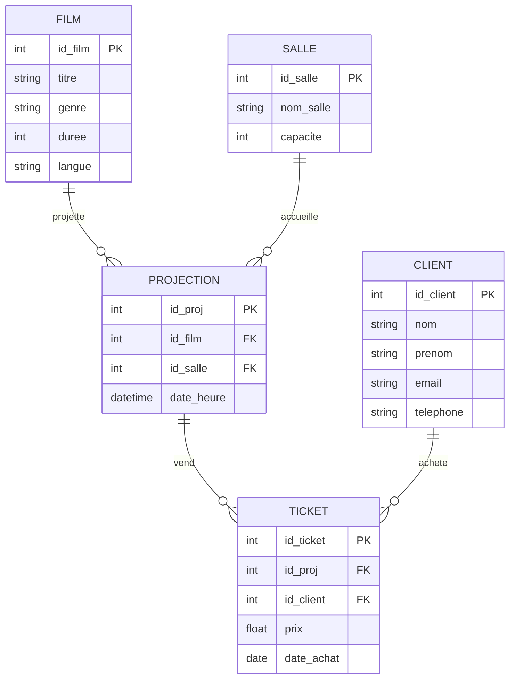
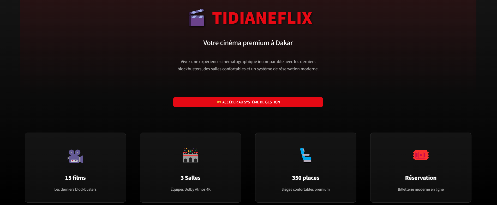
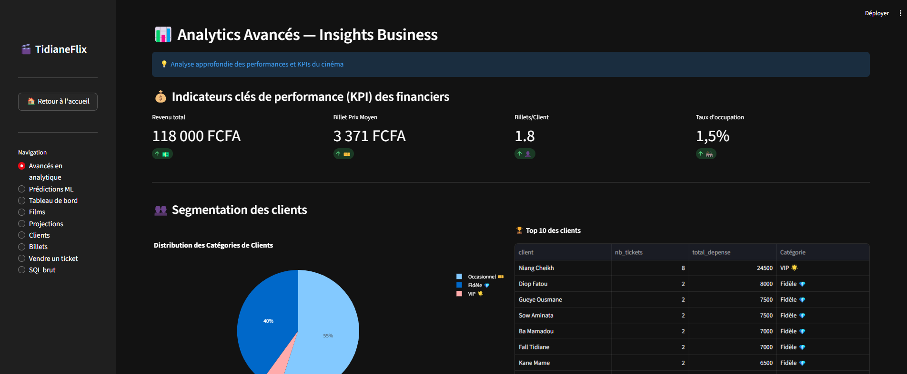
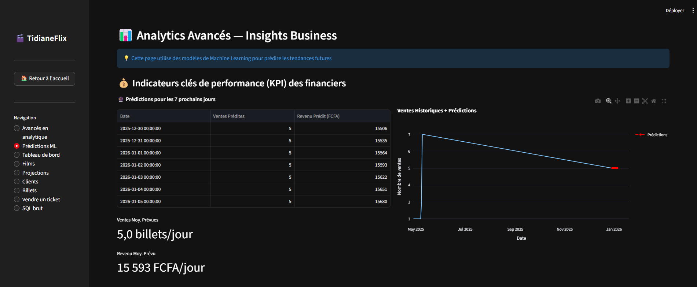
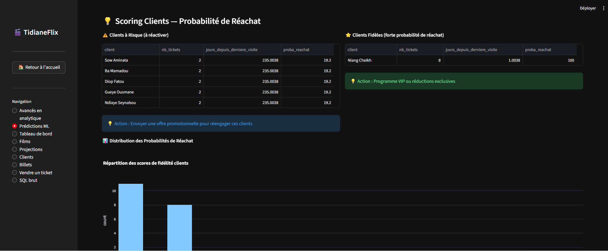
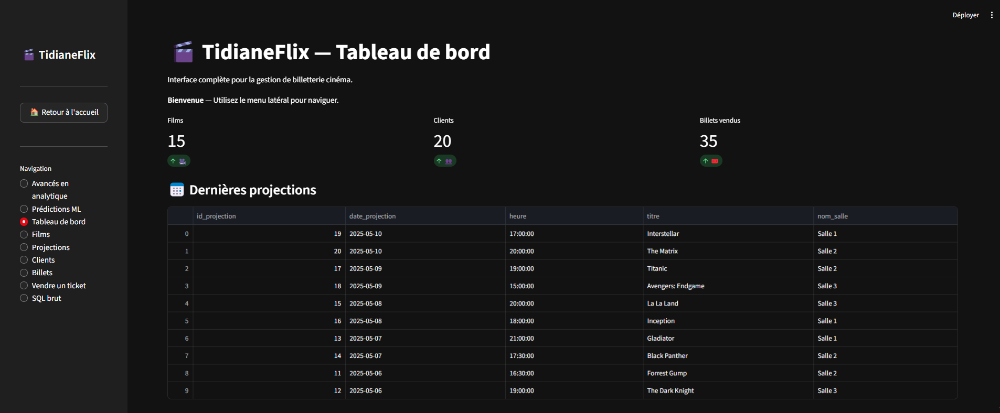

<div align="center">

# 🎬 TidianeFlix

### Système de Billetterie Cinéma Intelligent avec Analytics & ML

[](https://www.python.org/)
[](https://streamlit.io/)
[](https://www.sqlite.org/)
[](LICENSE)

[🌐 **Démo en ligne**](https://chniang-tidiane-flix-app-complete-cvsmk3.streamlit.app/) | [💻 **Code Source**](https://github.com/chniang/TIDIANE_FLIX) | [📧 **Contact**](mailto:cheikhniang159@gmail.com)


</div>

---

## 📑 Table des matières

- [🎯 À propos](#-à-propos)
- [✨ Fonctionnalités](#-fonctionnalités)
- [🛠️ Technologies](#️-technologies)
- [📊 Architecture](#-architecture)
- [🚀 Installation](#-installation)
- [📸 Aperçu](#-aperçu)
- [📈 Résultats](#-résultats)
- [🎓 Compétences](#-compétences)
- [🔮 Roadmap](#-roadmap)
- [👤 Auteur](#-auteur)
- [📄 Licence](#-licence)

---

## 🎯 À propos

**TidianeFlix** est une application web full-stack de gestion de billetterie pour cinéma, développée avec **Streamlit**. Elle combine une interface utilisateur élégante style Netflix avec des **capacités analytiques avancées** et des **modèles de machine learning** pour optimiser les opérations et maximiser les revenus.

### 🌟 Objectifs

| Objectif | Description |
|----------|-------------|
| 🎫 **Simplifier** | Gestion intuitive des ventes de billets |
| 📊 **Analyser** | Insights business actionnables en temps réel |
| 🔮 **Prédire** | Anticiper les tendances de ventes futures |
| 🎯 **Optimiser** | Maximiser le taux d'occupation des salles |
| 💎 **Fidéliser** | Identifier et retenir les clients à forte valeur |

---

## ✨ Fonctionnalités

<table>
<tr>
<td width="50%">

### 📊 Analytics Avancés
- ✅ **KPIs financiers** en temps réel
- ✅ **Segmentation clients** automatique
  - 🌟 VIP (≥10,000 FCFA)
  - 💎 Fidèle (≥5,000 FCFA)
  - 🎫 Occasionnel (<5,000 FCFA)
- ✅ **Top performers** (clients & films)
- ✅ **Tendances temporelles** interactives
- ✅ **Performance salles** vs objectifs

</td>
<td width="50%">

### 🤖 Machine Learning
- 🔮 **Prédiction ventes** (7 jours futurs)
- 🎬 **Recommandation films** par genre
- 💯 **Scoring clients** (probabilité réachat)
- 📈 **Optimisation occupation** salles
- 🎯 **Insights automatiques** actionnables

</td>
</tr>
<tr>
<td width="50%">

### 🎥 Gestion Opérationnelle
- 🎬 **Catalogue films** complet
- 🕐 **Planification projections**
- 👥 **Base clients** avec historique
- 🎟️ **Vente billets** rapide
- 💳 **Validation automatique**

</td>
<td width="50%">

### 🎨 Interface Utilisateur
- 🌟 **Landing page** style Netflix
- 🔄 **Navigation** "Data Science First"
- 📊 **Graphiques interactifs** Plotly
- 📱 **Responsive design**
- 🌙 **Dark theme** élégant

</td>
</tr>
</table>

---

## 🛠️ Technologies

<div align="center">

### Backend & Data


### Machine Learning


### Frontend & Visualisation


### DevOps


</div>

---

## 📊 Architecture

### 📐 Modèle de données

```mermaid
erDiagram
    FILM ||--o{ PROJECTION : projette
    SALLE ||--o{ PROJECTION : accueille
    PROJECTION ||--o{ TICKET : vend
    CLIENT ||--o{ TICKET : achete
    
    FILM {
        int id_film PK
        string titre
        string genre
        int duree
        string langue
    }
    
    SALLE {
        int id_salle PK
        string nom_salle
        int capacite
    }
    
    PROJECTION {
        int id_proj PK
        int id_film FK
        int id_salle FK
        datetime date_heure
    }
    
    CLIENT {
        int id_client PK
        string nom
        string prenom
        string email
        string telephone
    }
    
    TICKET {
        int id_ticket PK
        int id_proj FK
        int id_client FK
        float prix
        date date_achat
    }
```

### 📦 Données actuelles

| Table | Contenu | Description |
|-------|---------|-------------|
| 🎬 **Films** | 15 entrées | Inception, Titanic, Avengers, Matrix, Joker, etc. |
| 🏛️ **Salles** | 3 salles | Capacités: 120, 80, 150 places (total: 350) |
| 🕐 **Projections** | 20 séances | Mai 2025, réparties sur 3 salles |
| 👥 **Clients** | 20 clients | Noms sénégalais avec coordonnées |
| 🎟️ **Tickets** | 34 billets | Prix: 3,000-4,000 FCFA |

---

## 🚀 Installation

### 📋 Prérequis

- Python 3.12+
- pip (gestionnaire de paquets)

### ⚡ Installation rapide
```bash
# 1️⃣ Cloner le repository
git clone https://github.com/chniang/TIDIANE_FLIX.git
cd TIDIANE_FLIX

# 2️⃣ Installer les dépendances
pip install -r requirements.txt

# 3️⃣ Lancer l'application
streamlit run app_complete.py
```

L'application sera accessible sur **http://localhost:8501** 🚀

---

## 📸 Aperçu

<div align="center">

### 🎬 Landing Page

*Interface d'accueil style Netflix avec hero section et films à l'affiche*

### 📊 Analytics Dashboard

*KPIs financiers et segmentation clients en temps réel*

### 🔮 Prédictions ML

*Modèle de prédiction de ventes et recommandations personnalisées*

### 💯 Scoring Clients

*Analyse de probabilité de réachat et identification clients à risque*

### 🎯 Dashboard Principal

*Vue d'ensemble des performances et tendances*

</div>

---

## 📈 Résultats

<div align="center">

| Métrique | Valeur | Description |
|----------|--------|-------------|
| 💰 **Revenu total** | 109,000 FCFA | Chiffre d'affaires généré |
| 🎟️ **Billets vendus** | 34 | Volume de transactions |
| 💵 **Prix moyen** | 3,406 FCFA | Ticket moyen |
| 👥 **Clients actifs** | 20 | Base clients |
| 🏆 **Top client** | Niang Cheikh | 6 tickets, 100% réachat |
| 📊 **Prédiction** | 3 billets/jour | Tendance 7 jours |

</div>

### 🎯 Insights ML

- ✅ Segmentation clients : **3 catégories** (VIP, Fidèle, Occasionnel)
- ✅ Prédiction ventes : **Régression linéaire** sur 7 jours
- ✅ Scoring clients : **Formule personnalisée** (fréquence + récence)
- ✅ Recommandations : **Content-based filtering** par genre

---

## 🎓 Compétences

Ce projet démontre une maîtrise complète du cycle Data Science :

<table>
<tr>
<td width="33%">

### 🔧 Data Engineering
- ✅ Conception BDD relationnelle
- ✅ Migration MySQL → SQLite
- ✅ Contraintes d'intégrité
- ✅ Requêtes SQL optimisées

</td>
<td width="33%">

### 📊 Analytics & BI
- ✅ Calcul KPIs métiers
- ✅ Segmentation RFM
- ✅ Tendances temporelles
- ✅ Dashboards interactifs

</td>
<td width="33%">

### 🤖 Machine Learning
- ✅ Régression linéaire
- ✅ Scoring personnalisé
- ✅ Systèmes de recommandation
- ✅ Feature engineering

</td>
</tr>
<tr>
<td width="33%">

### 📈 Data Visualization
- ✅ Plotly interactif
- ✅ Design UX/UI
- ✅ Storytelling visuel

</td>
<td width="33%">

### 💻 Développement
- ✅ Architecture MVC
- ✅ Gestion d'état
- ✅ Clean code

</td>
<td width="33%">

### 🚀 Déploiement
- ✅ Streamlit Cloud
- ✅ CI/CD GitHub
- ✅ Production-ready

</td>
</tr>
</table>

---

## 🔮 Roadmap

### Version 2.0 (Prévue)

- [ ] 💳 Système de paiement en ligne (Stripe/PayPal)
- [ ] 📱 Notifications SMS/Email automatiques
- [ ] 🧠 Deep Learning pour recommandations avancées
- [ ] 🔌 API REST pour intégration mobile
- [ ] 💬 Analyse de sentiment des avis clients
- [ ] ⚡ Dashboard temps réel avec WebSockets

### Améliorations ML

- [ ] 📊 XGBoost pour prédictions plus précises
- [ ] 🤝 Collaborative filtering avancé
- [ ] 🔍 Détection d'anomalies (fraude)
- [ ] 💰 Optimisation dynamique des prix

---

## 👤 Auteur

<div align="center">

### Cheikh Niang
**Data Scientist Junior**

[](https://linkedin.com/in/cheikh-niang)
[](https://github.com/chniang)
[](mailto:cheikhniang159@gmail.com)
[](https://cheikh-niang-portfolio.streamlit.app)

📍 Dakar, Sénégal | 📞 +221 77 636 27 14

</div>

---

## 📄 Licence

Ce projet est sous licence **MIT**. Voir le fichier [LICENSE](LICENSE) pour plus de détails.

---

<div align="center">

### 🙏 Remerciements

Données de démonstration inspirées du contexte sénégalais  
Interface inspirée de Netflix pour une UX optimale  
Communauté Streamlit pour les composants et exemples

---

### ⭐ Si ce projet vous plaît

**N''oubliez pas de lui donner une étoile** ⭐

[](https://github.com/chniang/TIDIANE_FLIX/stargazers)

---

**Développé avec ❤️ à Dakar, Sénégal** 🇸🇳


</div>
