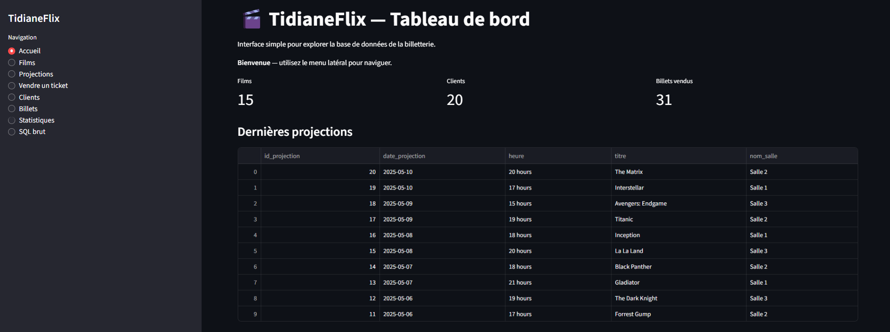
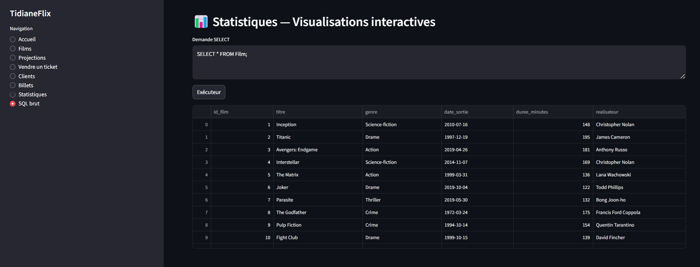
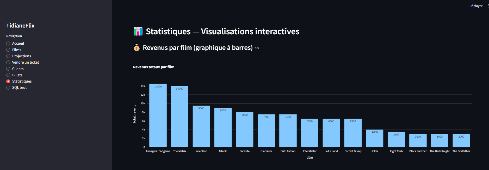
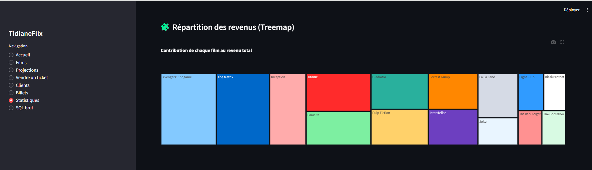
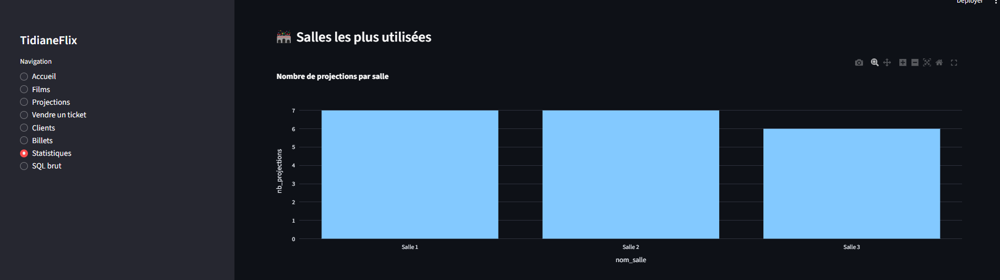
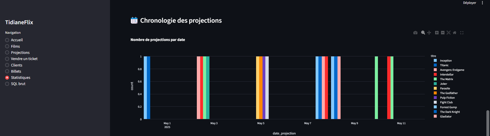
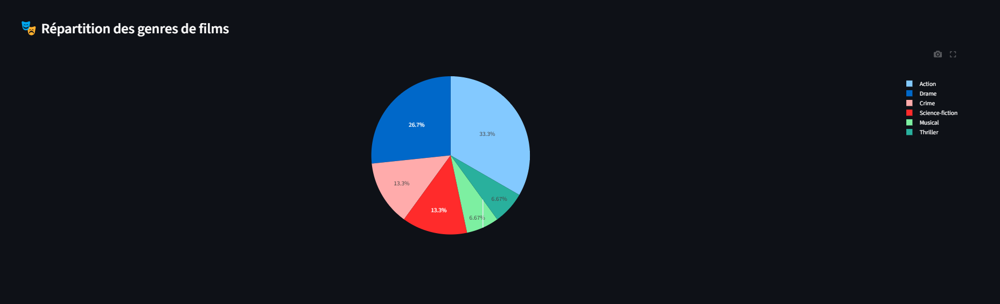

# 🎬 TIDIANE_FLIX

> Plateforme de visualisation et d’analyse de films/ séries avec interface utilisateur intuitive et visualisations statistiques.

[](https://www.python.org/)  
[](https://streamlit.io/)

---

## 📋 Table des Matières

- [Aperçu](#-aperçu)  
- [Fonctionnalités](#-fonctionnalités)  
- [Démo](#-démo)  
- [Architecture](#-architecture)  
- [Installation](#-installation)  
- [Utilisation](#-utilisation)  
- [Structure du Projet](#-structure-du-projet)  
- [Technologies](#-technologies)  
- [Contribution](#-contribution)  
- [Contact](#-contact)

---

## 🎯 Aperçu

TIDIANE_FLIX est une application web développée en Streamlit qui permet de :  
- visualiser des films/séries dans une interface web,  
- interroger une base de données SQL via une interface simplifiée,  
- et afficher des statistiques (graphiques) pour mieux comprendre les tendances.

---

## ✨ Fonctionnalités

- 🎥 **Accueil** : page d’introduction avec accès direct aux modules.  
- 🧮 **Interface de requête SQL** : exécution directe de requêtes sur la base `tidiane_flix.sql`.  
- 📊 **Statistiques & Dashboard** : plusieurs graphiques pour visualiser les métriques et tendances (ex : nombre de films par genre, années, popularité…).  
- 📸 **Captures d’écran** pour présentation visuelle.

---

## 🚀 Démo

### Screenshots  
<details><summary>📸 Cliquez pour voir les captures d’écran</summary>

#### Accueil  
  

#### Interface de requête SQL  
  

#### Statistiques (exemples)  
  
  
  
  
  

</details>

---

## 🏗️ Architecture

```mermaid
graph LR
    A[Base de données MySQL] --> B[Interface de requête SQL]
    B --> C[Streamlit App]
    C --> D[Visualisations & Dashboard]
📦 Installation
Prérequis
Python 3.x

pip

Git

MySQL (ou tout SGBD compatible)

Étapes
bash
Copier le code
# 1. Cloner le repository
git clone https://github.com/chniang/TIDIANE_FLIX.git
cd TIDIANE_FLIX

# 2. Créer un environnement virtuel
python -m venv venv
# activer l'environnement (Windows) :
venv\Scripts\activate

# 3. Installer les dépendances
pip install -r requirements.txt

# 4. Initialiser la base de données
mysql -u root -p < tidiane_flix.sql

# 5. Lancer l’application
streamlit run streamlit_app.py
🧩 Structure du Projet
arduino
Copier le code
TIDIANE_FLIX/
├── .streamlit/
│   └── config.toml
├── screenshots/
│   ├── accueil.png
│   ├── interface_de_requette_SQL.png
│   ├── statistique_1.png
│   ├── statistique_2.png
│   ├── statistique_3.png
│   ├── statistique_4.png
│   └── statistique_5.png
├── Model_Conceptuel et logique.pdf
├── tidiane_flix.sql
├── streamlit_app.py
├── requirements.txt
└── README.md
🛠️ Technologies
Python

Streamlit

MySQL / SQL

Pandas / NumPy (pour analyse)

Matplotlib / Plotly (pour visualisations)

🤝 Contribution
Vous êtes libre de contribuer : fork, branche dédiée, commit avec message clair, PR.
Merci de respecter : PEP8, docstrings, tests si ajout de logique.

📧 Contact
Nom : Cheikh Niang
Email : cheikhniang159@gmail.com
GitHub : https://github.com/chniang
Projet : https://github.com/chniang/TIDIANE_FLIX

<div align="center">Développé avec ❤️ à Dakar, Sénégal</div> ```
